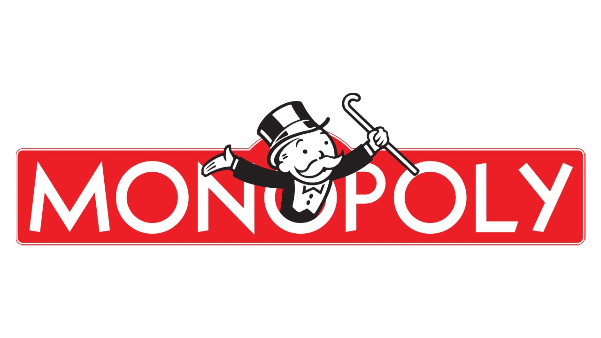

#  Monopoly Deal Cards

Welcome to the Monopoly Deal Cards game!

## Software Engineering Project

This project aims to bring the classic board game experience of Monopoly into a digital card game format. The objective of the game is to be the first player to collect three full property sets of different colors. In this game, you'll use Action cards to charge rent, swap cards, demand birthday money, and much more.

## How to Play
Run main.java...

## Group Number
**Group 8**

## Team Members and Contributions
**Zerui Zhan**
1

**Jiajun Li (21207296)**
1

**Weilun Zhou**
1

**Ziqi Wang**
1

Enjoy playing the Monopoly Deal Cards game!